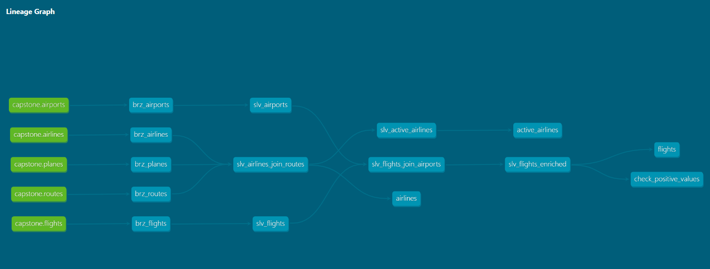

# dbt-capstone-demo

## A DBT capstone project similar to airline-demo where below feature covers:

Datasets used:
- airlines.csv
- airports.csv
- routes.csv
- planes.csv
- OpenFlights_Dataset (Flights 2008)

**Bronze Layer**:
- _sources.yml
- brz_airlines.sql
- brz_airports.sql
- brz_flights.sql
- brz_planes.sql
- brz_routes.sql

**Silver Layer**:
_models.yml
- slv_active_airlines.sql
- slv_airlines_join_routes.sql
- slv_airports.sql
- slv_flights_enriched.sql
- slv_flights_join_airports.sql
- slv_flights.sql

**Gold Layer**:
- _flights.md
- _flights.yml
- flights.sql
- active_airlines.sql
- airlines.sql
- flights.sql

## Model chaining:

## Sources:

Tables:

- Airlines Table (List of all airlines with information merged with planes and routes)
- Flights Table (List of all flights with information merged with airports) 

Aggregations:
- Active Airlines Table (List of active airlines)
- Most Common Routes (TO-DO)
- Average Departure Delay (TO-DO)
- Average Arrival Delay (TO-DO)

Views:
- brz_airlines
- brz_airports
- brz_flights
- brz_planes
- brz_routes

Ephemeral:
- slv_active_airlines
- slv_airlines_join_routes
- slv_airports
- slv_flights_enriched
- slv_flights_join_airports
- slv_flights

Incremental (append, merge):
- Flights Table

## Macros:
Macros created:

- if_NA_exists (clean up) convert to timestamp,int (simple macro)
- calculate_speed (simple macro)
- common_expressions (reference) (added random() instead of rand() due to snowflake syntax)

## Tests

Generic and Singular Test:
- assert_column_is_NA (check if NA values exists)
- expect_table_column_count_to_greater_then_or_equals_other_table (reference)

Use package macros (from dbt-utils, dbt-expectations) in model and testing

- dbt_utils.expression_is_true
- dbt_utils.generate_surrogate_key (args1,args2,...)
- dbt_expectations.expect_column_values_to_be_between

Documentation (models, source, test, macro):
- dbt docs generate

### Resources:
- Learn more about dbt [in the docs](https://docs.getdbt.com/docs/introduction)
- Check out [Discourse](https://discourse.getdbt.com/) for commonly asked questions and answers
- Join the [chat](https://community.getdbt.com/) on Slack for live discussions and support
- Find [dbt events](https://events.getdbt.com) near you
- Check out [the blog](https://blog.getdbt.com/) for the latest news on dbt's development and best practices
